<div align="center">

<!-- HERO BANNER (DARK / LIGHT THEME AWARE) -->
<picture>
  <source media="(prefers-color-scheme: dark)" srcset="assets/hero/hero-dark.svg">
  <source media="(prefers-color-scheme: light)" srcset="assets/hero/hero-light.svg">
  
</picture>

<br><br>

<!-- QUICK NAVIGATION BAR -->
<a href="#about"><code>ABOUT</code></a> &nbsp;•&nbsp;
<a href="#snapshot"><code>RECRUITER SNAPSHOT</code></a> &nbsp;•&nbsp;
<a href="#projects"><code>PROJECTS</code></a> &nbsp;•&nbsp;
<a href="#ai-lab"><code>AI LAB</code></a> &nbsp;•&nbsp;
<a href="#system-design"><code>SYSTEM DESIGN</code></a> &nbsp;•&nbsp;
<a href="#devops"><code>DEVOPS</code></a> &nbsp;•&nbsp;
<a href="#voice-ai"><code>VOICE AI</code></a> &nbsp;•&nbsp;
<a href="#tech-constellation"><code>TECH CONSTELLATION</code></a> &nbsp;•&nbsp;
<a href="#leetcode"><code>LEETCODE</code></a> &nbsp;•&nbsp;
<a href="#github-analytics"><code>GITHUB</code></a> &nbsp;•&nbsp;
<a href="#experience"><code>EXPERIENCE</code></a> &nbsp;•&nbsp;
<a href="#contact"><code>CONTACT</code></a>

<br><br>

</div>

<a name="about" id="about"></a>
---

### 01 // EXECUTIVE INTRO

**Computer Science Engineering student** specializing in building **AI-powered software systems, distributed workflows, and production-oriented applications**.

I engineer full-stack systems with architectural rigor — bridging foundation models, hybrid retrieval pipelines, real-time audio/WebRTC streams, event-driven backends, and embedded hardware telemetry into cohesive, deployable software.

```
SYSTEM PHILOSOPHY:  Design with clarity  •  Build for resilience  •  Measure telemetry  •  Ship to production
```

<a name="snapshot" id="snapshot"></a>
---

### 02 // RECRUITER QUICK-SCAN

<table>
<tr>
<td width="33%" valign="top">

#### 🤖 AI Systems
- **Agentic AI & Orchestration:** LangGraph, Multi-Agent Supervisors, MCP Tools
- **Hybrid RAG:** Vector Stores (ChromaDB), Dense/Sparse Retrieval, Re-ranking
- **Real-Time Voice AI:** LiveKit, WebRTC, VAD, Low-Latency Conversation FSMs

</td>
<td width="33%" valign="top">

#### ⚙️ Backend & Architecture
- **API & Microservices:** FastAPI, Node.js, Express, REST, WebSockets
- **Databases & Caching:** PostgreSQL, MongoDB, Redis, Schema Design
- **System Design:** Event-Driven Architecture, Asynchronous Workers, Message Queues

</td>
<td width="33%" valign="top">

#### 🚀 Frontend, Cloud & DSA
- **Frontend Systems:** React, Next.js, TypeScript, Zustand, Tailwind CSS
- **DevOps & Cloud:** Docker, GitHub Actions, Linux, CI/CD, Edge Deployments
- **Problem Solving:** LeetCode Rating 1773 (Top 9.47%), 219+ Problems Solved

</td>
</tr>
</table>

<div align="center">

<!-- ENGINEERING OS DASHBOARD -->
<picture>
  <source media="(prefers-color-scheme: dark)" srcset="assets/diagrams/engineering-os-dark.svg">
  <source media="(prefers-color-scheme: light)" srcset="assets/diagrams/engineering-os-light.svg">
  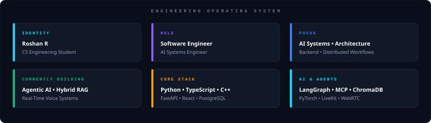
</picture>

</div>

---

### 03 // LIVE TERMINAL EXPERIENCE

<div align="center">

<picture>
  <source media="(prefers-color-scheme: dark)" srcset="assets/terminal/terminal-dark.svg">
  <source media="(prefers-color-scheme: light)" srcset="assets/terminal/terminal-light.svg">
  
</picture>

</div>

---

### 04 // HOW I THINK // ENGINEERING LIFECYCLE

<div align="center">

<picture>
  <source media="(prefers-color-scheme: dark)" srcset="assets/diagrams/engineering-pipeline-dark.svg">
  <source media="(prefers-color-scheme: light)" srcset="assets/diagrams/engineering-pipeline-light.svg">
  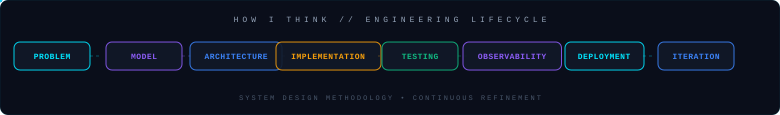
</picture>

</div>

<a name="projects" id="projects"></a>
---

### 05 // FEATURED PROJECT CASE STUDIES

<table>
<tr>
<td width="50%" valign="top">

### 🌐 RConnectX
**AI-Powered Startup Networking & Founder Matching**

- **Domain:** Distributed Web Platform • Startup Ecosystem
- **Problem:** Fragmented networking workflows with zero contextual discovery or intelligent founder matching.
- **Engineering Approach:** Built a high-concurrency platform with AI-driven matching feeds, bidirectional WebSocket messaging, and OAuth2 security.
- **Stack:** `Next.js` `TypeScript` `FastAPI` `PostgreSQL` `WebSocket` `Cloudinary`
- **Links:** [Repository](https://github.com/Roshanrameshhub/nexus) &nbsp;|&nbsp; [Live Platform](https://www.rconnectx.com/)

<div align="center">
<picture>
  <source media="(prefers-color-scheme: dark)" srcset="assets/projects/rconnectx-arch-dark.svg">
  <source media="(prefers-color-scheme: light)" srcset="assets/projects/rconnectx-arch-light.svg">
  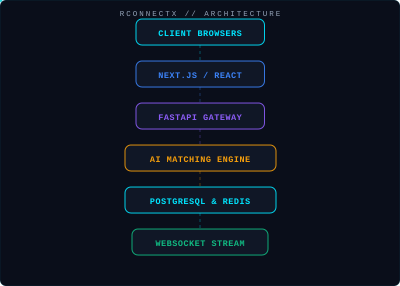
</picture>
</div>

</td>
<td width="50%" valign="top">

### 🤖 AgentForge
**Autonomous Multi-Agent Orchestration & Hybrid RAG**

- **Domain:** Agentic AI • Knowledge Graphs • Tool Orchestration
- **Problem:** Complex multi-agent coordination lacks deterministic routing, state persistence, and external tool sandboxing.
- **Engineering Approach:** Engineered supervisor agent patterns using LangGraph, Model Context Protocol (MCP), ChromaDB dense retrieval, and Redis memory.
- **Stack:** `Python` `LangGraph` `FastAPI` `ChromaDB` `MCP` `Redis` `Streamlit`
- **Links:** [Repository](https://github.com/Roshanrameshhub/AgentForge) &nbsp;⭐ 7 Stars &nbsp;|&nbsp; `MIT License`

<div align="center">
<picture>
  <source media="(prefers-color-scheme: dark)" srcset="assets/projects/agentforge-arch-dark.svg">
  <source media="(prefers-color-scheme: light)" srcset="assets/projects/agentforge-arch-light.svg">
  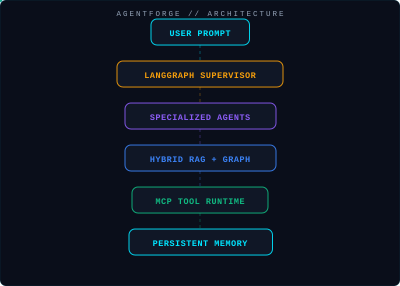
</picture>
</div>

</td>
</tr>
<tr>
<td width="50%" valign="top">

### 🌱 SmartFert-AI
**Precision Agriculture Telemetry & Automated Dispensing**

- **Domain:** AI + IoT • Embedded Systems • Predictive ML
- **Problem:** Over-fertilization and soil degradation caused by lack of real-time nutrient telemetry.
- **Engineering Approach:** Interfaced ESP32 microcontrollers with soil sensors, transmitting real-time telemetry to FastAPI for ML-based NPK optimization and automated valve actuation.
- **Stack:** `Python` `FastAPI` `React` `TypeScript` `ESP32` `Scikit-Learn`
- **Links:** [Repository](https://github.com/Roshanrameshhub/SmartFert-ai)

<div align="center">
<picture>
  <source media="(prefers-color-scheme: dark)" srcset="assets/projects/smartfert-arch-dark.svg">
  <source media="(prefers-color-scheme: light)" srcset="assets/projects/smartfert-arch-light.svg">
  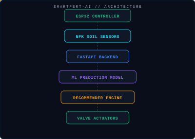
</picture>
</div>

</td>
<td width="50%" valign="top">

### 🛡️ Guardian-AI
**AI-Powered Personal Safety & Real-Time Distress Detection**

- **Domain:** Mobile Systems • Edge AI • Geo-Telemetry
- **Problem:** Emergency SOS systems require active manual intervention when users are in immediate physical danger.
- **Engineering Approach:** Implemented passive voice distress classification, accelerometer fall detection, live GPS breadcrumb tracking, and instant multi-channel SOS dispatch.
- **Stack:** `Flutter` `Dart` `FastAPI` `Gemini AI` `PostgreSQL` `Redis` `Twilio`
- **Links:** [Repository](https://github.com/Roshanrameshhub/guardian-ai)

<div align="center">
<picture>
  <source media="(prefers-color-scheme: dark)" srcset="assets/projects/guardian-arch-dark.svg">
  <source media="(prefers-color-scheme: light)" srcset="assets/projects/guardian-arch-light.svg">
  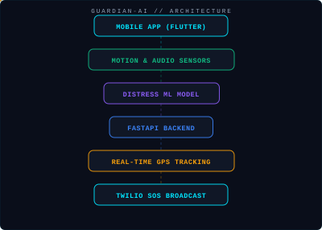
</picture>
</div>

</td>
</tr>
</table>

<a name="ai-lab" id="ai-lab"></a>
---

### 06 // AI ENGINEERING LAB

<div align="center">

<picture>
  <source media="(prefers-color-scheme: dark)" srcset="assets/architecture/ai-lab-dark.svg">
  <source media="(prefers-color-scheme: light)" srcset="assets/architecture/ai-lab-light.svg">
  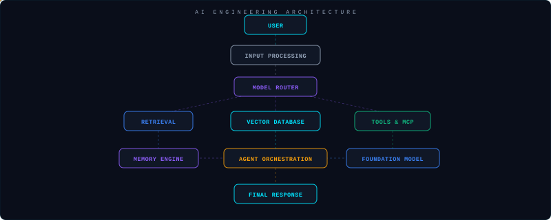
</picture>

<br><br>

<picture>
  <source media="(prefers-color-scheme: dark)" srcset="assets/architecture/rag-pipeline-dark.svg">
  <source media="(prefers-color-scheme: light)" srcset="assets/architecture/rag-pipeline-light.svg">
  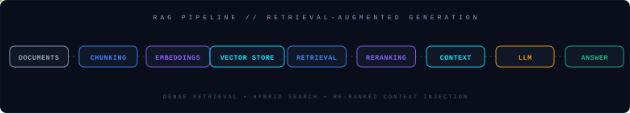
</picture>

<br><br>

<picture>
  <source media="(prefers-color-scheme: dark)" srcset="assets/architecture/agent-architecture-dark.svg">
  <source media="(prefers-color-scheme: light)" srcset="assets/architecture/agent-architecture-light.svg">
  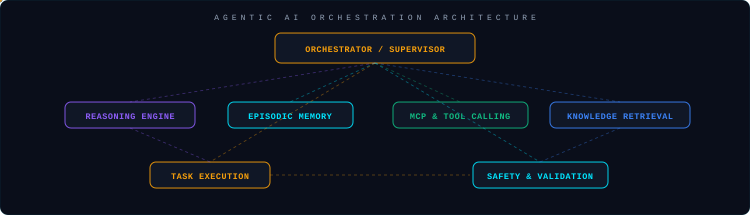
</picture>

</div>

<a name="system-design" id="system-design"></a>
---

### 07 // SYSTEM DESIGN LAB

<div align="center">

<picture>
  <source media="(prefers-color-scheme: dark)" srcset="assets/architecture/system-design-dark.svg">
  <source media="(prefers-color-scheme: light)" srcset="assets/architecture/system-design-light.svg">
  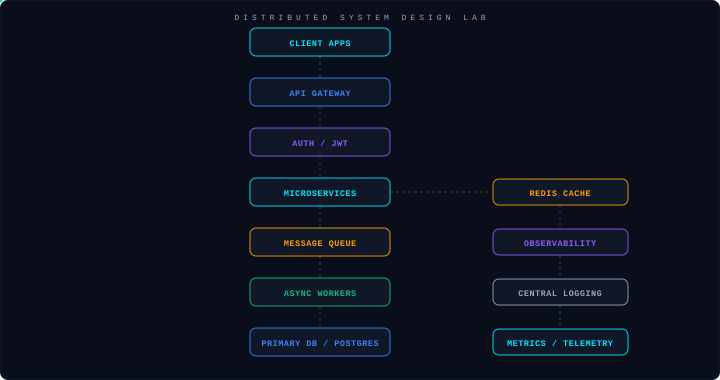
</picture>

</div>

<a name="devops" id="devops"></a>
---

### 08 // DEVOPS & CI/CD PIPELINE

<div align="center">

<picture>
  <source media="(prefers-color-scheme: dark)" srcset="assets/architecture/devops-pipeline-dark.svg">
  <source media="(prefers-color-scheme: light)" srcset="assets/architecture/devops-pipeline-light.svg">
  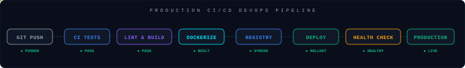
</picture>

</div>

<a name="voice-ai" id="voice-ai"></a>
---

### 09 // REAL-TIME VOICE AI & IoT SYSTEMS

<table>
<tr>
<td width="50%" valign="top">

#### 🎙️ Voice AI Pipeline (WebRTC & LiveKit)
<picture>
  <source media="(prefers-color-scheme: dark)" srcset="assets/architecture/voice-ai-dark.svg">
  <source media="(prefers-color-scheme: light)" srcset="assets/architecture/voice-ai-light.svg">
  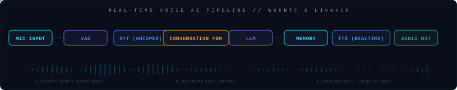
</picture>

- **Turn Latency:** Sub-300ms turnarounds
- **Protocols:** LiveKit WebRTC DataChannel
- **State Control:** Finite State Machines with Barge-In handling

</td>
<td width="50%" valign="top">

#### 🌱 Intelligent IoT & Hardware Telemetry
<picture>
  <source media="(prefers-color-scheme: dark)" srcset="assets/architecture/iot-system-dark.svg">
  <source media="(prefers-color-scheme: light)" srcset="assets/architecture/iot-system-light.svg">
  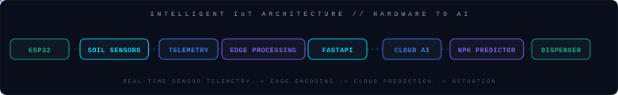
</picture>

- **Microcontroller:** ESP32 with direct analog/digital sensor bus
- **Telemetry Protocol:** JSON HTTP / WebSocket edge stream
- **Automation:** Closed-loop ML prediction to actuation

</td>
</tr>
</table>

<a name="tech-constellation" id="tech-constellation"></a>
---

### 10 // TECHNOLOGY CONSTELLATION

<div align="center">

<picture>
  <source media="(prefers-color-scheme: dark)" srcset="assets/tech/constellation-dark.svg">
  <source media="(prefers-color-scheme: light)" srcset="assets/tech/constellation-light.svg">
  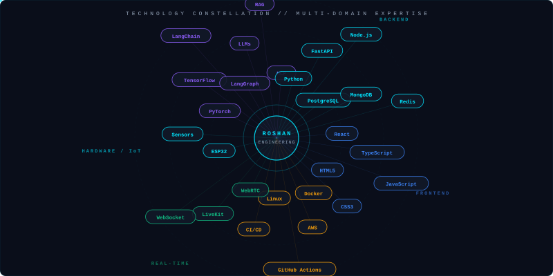
</picture>

</div>

<a name="leetcode" id="leetcode"></a>
---

### 11 // LEETCODE COMMAND CENTER

> **Verified Telemetry from [@RoshanR_in](https://leetcode.com/u/RoshanR_in/)** • Auto-synced weekly via GitHub Actions

<div align="center">

<!-- LEETCODE STATS BAR -->
<picture>
  <source media="(prefers-color-scheme: dark)" srcset="assets/leetcode/stats-dark.svg">
  <source media="(prefers-color-scheme: light)" srcset="assets/leetcode/stats-light.svg">
  
</picture>

<br><br>

<!-- SUBMISSION HEATMAP -->
<picture>
  <source media="(prefers-color-scheme: dark)" srcset="assets/leetcode/heatmap-dark.svg">
  <source media="(prefers-color-scheme: light)" srcset="assets/leetcode/heatmap-light.svg">
  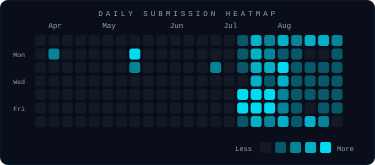
</picture>

<br><br>

<table width="100%">
<tr>
<td width="50%" align="center" valign="top">

#### 🎯 Skill Radar (DSA Mastery)
<picture>
  <source media="(prefers-color-scheme: dark)" srcset="assets/leetcode/skill-radar-dark.svg">
  <source media="(prefers-color-scheme: light)" srcset="assets/leetcode/skill-radar-light.svg">
  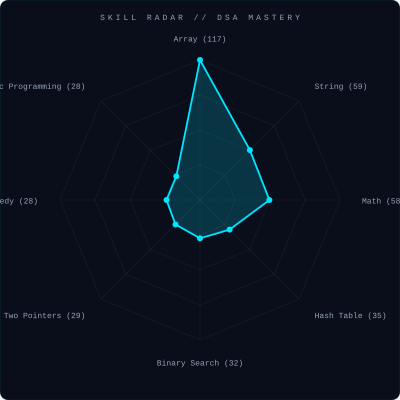
</picture>

</td>
<td width="50%" align="center" valign="top">

#### ⚡ Consistency & Badge Telemetry
<picture>
  <source media="(prefers-color-scheme: dark)" srcset="assets/leetcode/streak-dark.svg">
  <source media="(prefers-color-scheme: light)" srcset="assets/leetcode/streak-light.svg">
  
</picture>

```
CORE PROBLEM TOPICS:
• Arrays (110)        • Strings (59)
• Math (56)           • Hash Tables (34)
• Binary Search (32)  • Two Pointers (29)
• Dynamic Prog (28)   • Greedy (27)
• Sorting (25)        • Linked Lists (20)
• Backtracking (13)   • Recursion (11)
```

</td>
</tr>
</table>

</div>

<a name="github-analytics" id="github-analytics"></a>
---

### 12 // GITHUB ANALYTICS & CODE TELEMETRY

<div align="center">

<!-- LANGUAGE DNA -->
<picture>
  <source media="(prefers-color-scheme: dark)" srcset="assets/github/language-dna-dark.svg">
  <source media="(prefers-color-scheme: light)" srcset="assets/github/language-dna-light.svg">
  
</picture>

<br><br>

<!-- ENGINEERING SCOREBOARD -->
<picture>
  <source media="(prefers-color-scheme: dark)" srcset="assets/github/scoreboard-dark.svg">
  <source media="(prefers-color-scheme: light)" srcset="assets/github/scoreboard-light.svg">
  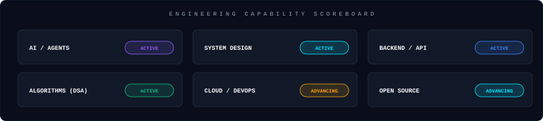
</picture>

<br><br>

<!-- CONTRIBUTION SKYLINE -->
<picture>
  <source media="(prefers-color-scheme: dark)" srcset="assets/github/skyline-dark.svg">
  <source media="(prefers-color-scheme: light)" srcset="assets/github/skyline-light.svg">
  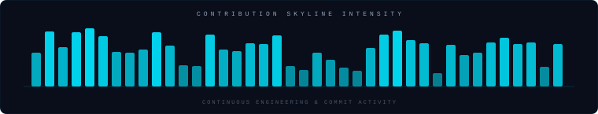
</picture>

<br><br>

<!-- CONTRIBUTION SNAKE -->
<picture>
  <source media="(prefers-color-scheme: dark)" srcset="assets/github/github-contribution-grid-snake-dark.svg">
  <source media="(prefers-color-scheme: light)" srcset="assets/github/github-contribution-grid-snake-light.svg">
  
</picture>

<br><br>

<!-- ACTIVITY PULSE -->
<picture>
  <source media="(prefers-color-scheme: dark)" srcset="assets/github/activity-pulse-dark.svg">
  <source media="(prefers-color-scheme: light)" srcset="assets/github/activity-pulse-light.svg">
  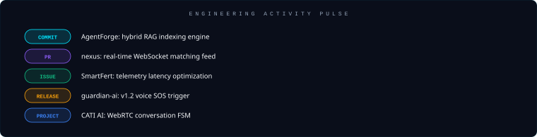
</picture>

</div>

<a name="experience" id="experience"></a>
---

### 13 // ENGINEERING TIMELINE & EXPERIENCE

```
LEARNING & FOUNDATIONS  ──►  PROJECT ARCHITECTURE  ──►  INTERNSHIPS  ──►  OPEN SOURCE  ──►  PRODUCTION SYSTEMS
```

<table>
<tr>
<td width="50%" valign="top">

#### 🚀 RConnectX
**Technical & Product Engineering**
- **Domain:** Startup Networking & Matching Platform
- **Systems:** `Next.js` `FastAPI` `PostgreSQL` `WebSocket` `AI Matching`
- **Focus:** AI-powered founder recommendation engine, real-time collaboration streams, database schema architecture, and high-performance frontend engineering.
- 🌐 [rconnectx.com](https://www.rconnectx.com/)

</td>
<td width="50%" valign="top">

#### 🎙️ CATI AI
**AI / Voice AI Intern**
- **Domain:** Real-Time Conversational AI
- **Systems:** `LiveKit` `WebRTC` `React` `Zustand` `Voice Pipelines`
- **Focus:** Real-time conversational AI, Test Agent state management, LiveKit/WebRTC event orchestration, multi-turn dialogue state machines, and barge-in interruption handling.

</td>
</tr>
<tr>
<td width="50%" valign="top">

#### 🌍 Rakshan Earth & Space Management
**Technical Intern**
- **Domain:** Engineering Operations & Workflows
- **Systems:** Technical pipelines and real-world engineering environments
- **Focus:** Hands-on operational exposure to structured engineering workflows and collaborative systems.

</td>
<td width="50%" valign="top">

#### 🚀 FlyRank
**AI / Engineering Experience**
- **Domain:** AI-Powered Growth & Search Systems
- **Systems:** `AI Agents` `Semantic Search` `Automations`
- **Focus:** Exposure to agentic AI workflows, intelligent search retrieval, and automated growth pipelines.
- 🌐 [flyrank.ai](https://flyrank.ai/)

</td>
</tr>
</table>

<a name="open-source" id="open-source"></a>
---

### 14 // OPEN SOURCE & COMMUNITY SIGNAL

#### 💻 GirlScript Summer of Code (GSSoC)
- **Role:** Open Source Contributor
- **Focus:** Collaborating on open-source repositories through GitHub workflows, PR code reviews, issue resolution, and feature implementations.
- 🌐 [gssoc.girlscript.org](https://gssoc.girlscript.org/)

---

### 15 // ACHIEVEMENTS WALL

<table>
<tr>
<td width="33%" align="center">

🏆 **LeetCode Contest**  
`Rating 1773.12 • Top 9.47%`  
Biweekly 189: Solved 4/4 (Rank #639)

</td>
<td width="33%" align="center">

🎖️ **LeetCode 50-Day Badge**  
`50 Days Badge 2026`  
Verified consistency badge

</td>
<td width="33%" align="center">

⭐ **AgentForge Open Source**  
`7 Stars • MIT License`  
Multi-agent framework on GitHub

</td>
</tr>
<tr>
<td width="33%" align="center">

🌐 **RConnectX Platform**  
`Production Web Platform`  
Live startup ecosystem platform

</td>
<td width="33%" align="center">

🌱 **SmartFert-AI**  
`Precision Agriculture`  
ESP32 + ML closed-loop system

</td>
<td width="33%" align="center">

🛡️ **Guardian-AI**  
`Personal Safety Edge AI`  
Flutter + Gemini distress detection

</td>
</tr>
</table>

<a name="now-building" id="now-building"></a>
---

### 16 // NOW BUILDING

```
● [ACTIVE]    Agentic AI Orchestration (LangGraph + MCP Tools)
● [ACTIVE]    Hybrid RAG Pipelines & Dense/Sparse Vector Retrieval
● [ACTIVE]    Real-Time Voice AI (LiveKit WebRTC + Whisper + FSM)
● [ADVANCING] Distributed System Architecture & Microservice Gateways
● [ADVANCING] Advanced Data Structures & Algorithms (LeetCode Daily)
● [EXPLORING] Edge AI & IoT Embedded Automation (ESP32 Telemetry)
```

---

### 17 // ENGINEERING MANIFESTO

```
┌────────────────────────────────────────────────────────┐
│                                                        │
│   01. DESIGN BEFORE SCALE                              │
│   02. BUILD BEFORE BOAST                               │
│   03. MEASURE BEFORE OPTIMIZE                          │
│   04. SHIP BEFORE PERFECT                              │
│                                                        │
└────────────────────────────────────────────────────────┘
```

<a name="contact" id="contact"></a>
---

### 18 // CONNECT & INITIATE

<div align="center">

<a href="https://github.com/Roshanrameshhub">
  
</a> &nbsp;
<a href="https://www.linkedin.com/in/roshan1833">
  
</a> &nbsp;
<a href="https://leetcode.com/u/RoshanR_in/">
  
</a> &nbsp;
<a href="mailto:rosharnithisha123@gmail.com">
  
</a>

<br><br>

<a href="https://www.rconnectx.com/">
  
</a> &nbsp;
<a href="https://flyrank.ai/">
  
</a> &nbsp;
<a href="https://gssoc.girlscript.org/">
  
</a>

</div>

<br>

<div align="center">

<!-- AURORA FOOTER -->
<picture>
  <source media="(prefers-color-scheme: dark)" srcset="assets/footer/footer-dark.svg">
  <source media="(prefers-color-scheme: light)" srcset="assets/footer/footer-light.svg">
  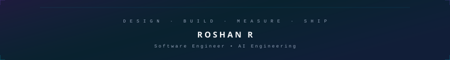
</picture>

</div>
